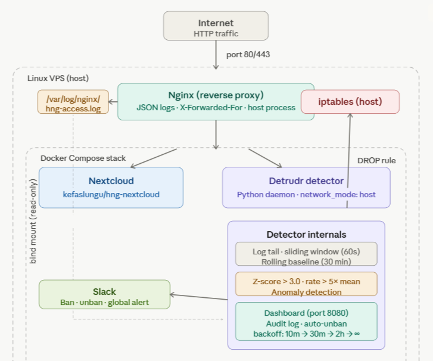

# Detrudr

`detrudr` is a DevSecOps HTTP traffic-anomaly/DDOS detection and counter engine. That runs beside any containerized server/application that needs to be protected, tails nginx JSON access logs in real time, learns a rolling traffic baseline, detects suspicious spikes, blocks abusive IPs with `iptables`, and exposes a live dashboard.

- Blog post: `https://okpainmo.github.io/blog/categories/cloud-and-devops/checking-traffic-anomally-and-ddos-with-detrudr`

## Language Choice

This project uses Python.

Why Python:

Primarily because I'm more comfortable using Python than Golang - which happens to be the only other available option. Plus, Python is a great language used extensively in DevOps/DevSecOps operations.

## What The Daemon Does

- Tails nginx JSON access logs from `/var/log/nginx/hng-access.log` or `LOG_PATH`.
- Parses `source_ip`, `timestamp`, `method`, `path`, `status`, and `response_size`.
- Maintains two deque-driven 60-second sliding windows:
  one global request window and one per-IP request window.
- Recomputes rolling baselines every 60 seconds from the last 30 minutes of per-second samples.
- Detects anomalies with either:
  z-score `> 3.0`, or request rate `> 5x` baseline mean.
- Tightens per-IP thresholds automatically when that IP’s 4xx/5xx ratio surges above `3x` the learned error baseline.
- Blocks anomalous IPs with `iptables`.
- Unbans on a backoff schedule:
  `10 minutes`, `30 minutes`, `2 hours`, then permanent.
- Sends Slack alerts for:
  ban, unban, and global anomaly events.
- Serves a live dashboard with:
  banned IPs, global req/s, top IPs, CPU, memory, effective baseline, and uptime.
- Writes audit records in the required format:
  `[timestamp] ACTION ip | condition | rate | baseline | duration`

## Core Repository Structure

```text
detector/
  main.py
  monitor.py
  baseline.py
  detector.py
  blocker.py
  unbanner.py
  notifier.py
  dashboard.py
  config.yaml
  requirements.txt
  .env
  .env.sample
  Dockerfile
nginx/
  nginx.conf
docs/
  architecture.png
screenshots/
README.md
docker-compose.yaml
```

## Architecture Summary



## Sliding Window Design

The task explicitly requires deque-based sliding windows instead of coarse counters.

How this project does it:
- `./detector/detector.py` stores one global `deque[datetime]`.
- It also stores one `deque[datetime]` per source IP.
- Every new request appends its timestamp into the global deque and that IP’s deque.
- On each event and periodic tick, entries older than 60 seconds are evicted from the left side of each deque.

Why this works:
- The current request rate is always derived from timestamps that still fall within the last 60 seconds.
- Eviction is exact to the second and not faked with a single per-minute bucket.
- The same pattern is used for error tracking with separate error deques.

## Baseline Design

The baseline logic lives in `./detector/baseline.py`.

Rules implemented:
- Window size: `1800` seconds, which is `30 minutes`.
- Recalculation interval: `60` seconds.
- Sample type: per-second request counts.
- Hour preference: the daemon keeps samples grouped by hour slot and prefers the current hour when there are enough samples.
- Fallback: if the current hour does not yet have enough data, it merges the most recent rolling samples across hour boundaries.
- Floor values:
  `floor_mean: 1.0`, `floor_stddev: 0.5`
- Error baseline floor values:
  `error_floor_mean: 0.05`, `error_floor_stddev: 0.01`

Why floor values are needed:
- They avoid divide-by-zero behavior or overly sensitive detection during startup or quiet periods.
- They keep the engine stable until enough real traffic has been observed.

## Detection Logic

The main detection logic is in `./detector/detector.py`.

Per-IP anomaly conditions:
- Compute the IP’s current request rate from its 60-second deque.
- Compare it to that IP’s learned baseline.
- Trigger if:
  z-score `> 3.0`, or current rate `> 5x` baseline mean.

Global anomaly conditions:
- Compute global req/s from the global 60-second deque.
- Compare it to the global learned baseline.
- Trigger if:
  z-score `> 3.0`, or current rate `> 5x` baseline mean.
- Global anomalies send Slack alerts only.

Error surge handling:
- For each IP, the daemon tracks 4xx/5xx events.
- If the IP’s error ratio exceeds `3x` the learned error baseline, thresholds are tightened automatically.
- This makes noisy scanners easier to catch sooner.

## Blocking And Unbanning

Blocking logic lives in `./detector/blocker.py`.

Behavior:
- Per-IP anomaly:
  add an `iptables` `DROP` rule.
- Global anomaly:
  send alert only, no blocking.

Unban schedule:
1. First strike: `10 minutes`
2. Second strike: `30 minutes`
3. Third strike: `2 hours`
4. Fourth strike onward: permanent

The daemon emits a Slack notification on every unban and writes each ban/unban event to the audit log.

## Dashboard

The embedded dashboard lives in `./detector/dashboard.py`.

Default binding:
- Host: `0.0.0.0`
- Port: `8080`

Displayed metrics:
- Banned IPs
- Global req/s
- Current second request count
- Top 10 source IPs
- CPU usage
- Memory usage
- Effective mean and stddev
- Uptime
- Recent audit entries

The page auto-refreshes every 3 seconds, which satisfies the task’s refresh requirement.

## Configuration

Static detector thresholds live in `./detector/config.yaml`.

Secrets and environment-specific values live in `./detector/.env`.

Example `.env`:

```env
WEB_HOOK_URL=https://hooks.slack.com/services/...
CHANNEL=#detrudr-alerts
LOG_PATH=/var/log/nginx/hng-access.log
```

Notes:
<!-- - `LOG_PATH` overrides the YAML log path. -->
- Slack webhook and channel are intentionally loaded from `.env`, not from `config.yaml`.

## Setup From A Fresh VPS

These steps document the intended deployment path for grading.

### 1. Provision the VPS

- Ubuntu 22.04 or similar
- Minimum `2 vCPU`
- Minimum `2 GB RAM`
- Open ports:
  `80`, `443`

### 2. Prepare Your Server

```bash
sudo apt update
sudo apt install -y docker.io docker-compose-plugin nginx python3-venv certbot python3-certbot-nginx
sudo systemctl enable --now docker nginx
```

### 3. Clone the repository

```bash
git clone https://github.com/Okpainmo/detrudr.git
cd detrudr
```

### 4. Prepare the detector environment

```bash
cp detector/.env.sample detector/.env
```

Fill in:
- `WEB_HOOK_URL`
- `CHANNEL`
- `LOG_PATH`

If nginx writes directly on the host, make sure `LOG_PATH` points to the real JSON access log file.

### 5. Configure host nginx

The task requires nginx to:
- run as the reverse proxy in front of Nextcloud
- trust and forward the real client IP with `X-Forwarded-For`
- emit JSON access logs at `/var/log/nginx/hng-access.log`

A working nginx configuration can be found in `./nginx/nginx.conf`.

Expected log format:

```nginx
log_format json_combined escape=json
'{'
  '"source_ip":"$remote_addr",'
  '"timestamp":"$time_iso8601",'
  '"method":"$request_method",'
  '"path":"$request_uri",'
  '"status":$status,'
  '"response_size":$body_bytes_sent'
'}';

access_log /var/log/nginx/hng-access.log json_combined;
```

Expected forwarded headers:

```nginx
proxy_set_header X-Real-IP $remote_addr;
proxy_set_header X-Forwarded-For $proxy_add_x_forwarded_for;
proxy_set_header X-Forwarded-Proto $scheme;
```

### 6. Build and start the containers

```bash
docker compose up -d --build
```

This starts:
- `kefaslungu/hng-nextcloud` on `127.0.0.1:8000` - configured to run on `https://nextcloud.xentoprotocol.xyz`
- the detector daemon on port `8080` - configured to run on `https://detrudr.xentoprotocol.xyz`

## Audit Log

Default audit log path:

```text
sudo docker exec -it detrudr-detector sh -c 'tail -n 12 -f /tmp/detrudr-audit.log'
```

Example event format:

```text
[2026-04-29T07:36:39.766020+00:00] BASELINE global | recalculated | 1.00 | 1.00 | rolling
[2026-04-29T07:45:10.100000+00:00] BAN 198.51.100.10 | ip_rate | 7.20 | 1.10 | 10m
[2026-04-29T07:55:10.200000+00:00] UNBAN 198.51.100.10 | ip_rate | 0.00 | 1.30 | 10m
```
